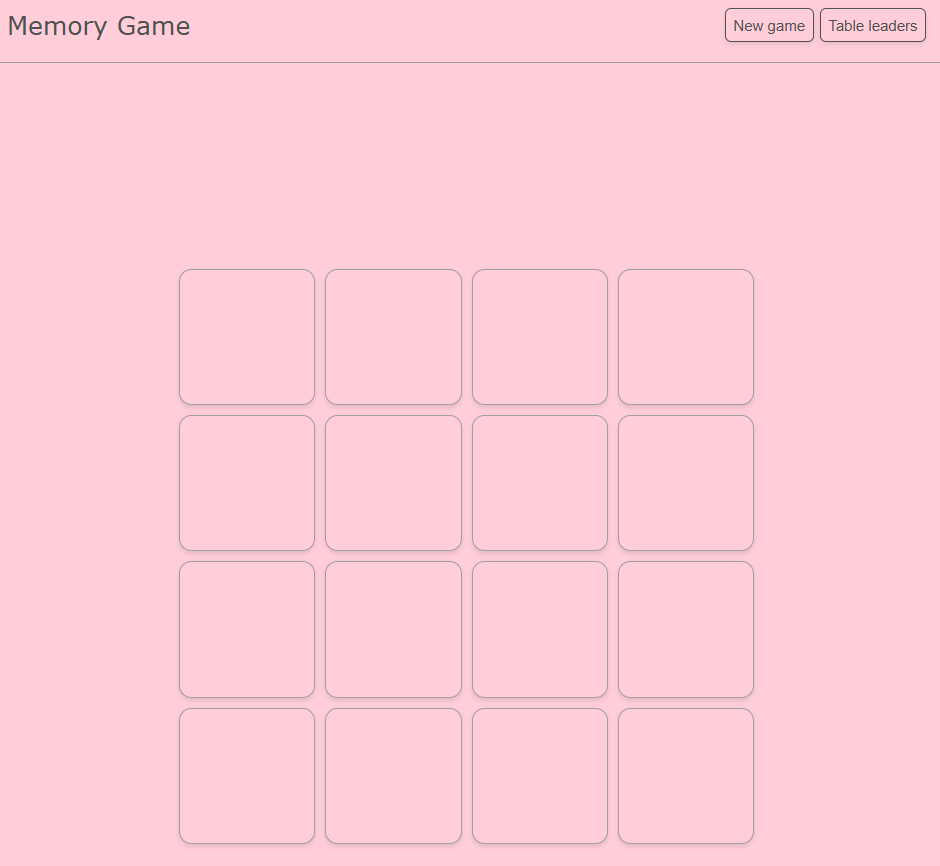

# Memory Game

**Demo:** [alina200508.github.io/memory-game](https://alina200508.github.io/memory-game/)



---

## How to play:


1. Click **New game** to start new game.

2. Click on cards to flip them - two at a time.

3. If the images match, the cards stay open.

4. If they don't match, the cards flip back after 0.8s.

5. The goal is to find all 8 pairs in as few moves as possible.

6. After you win, your results is automatically saved to the leaderboard.

7. Click ** Table leaders** to view the best results.

---

## Local launch

Download repo and open `index.html` in browser.

```bash
git clone https://github.com/alina200508/memory-game.git
cd memory-game
```
